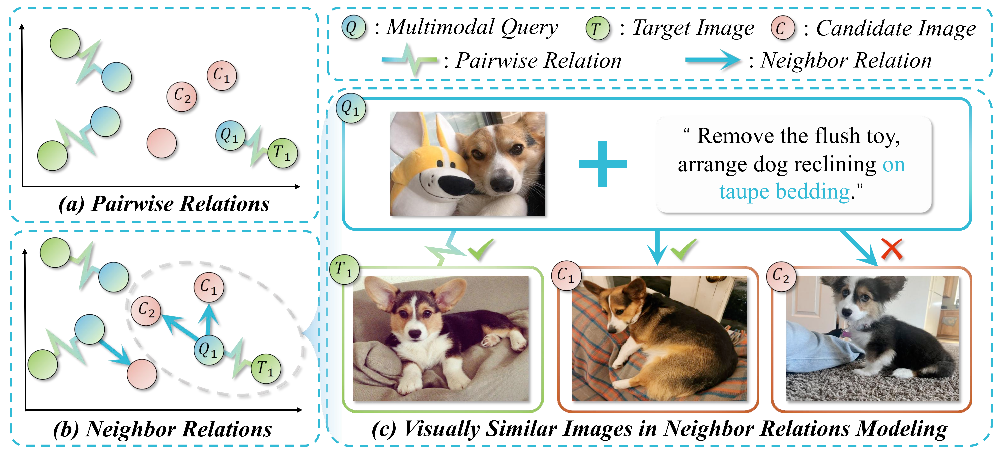
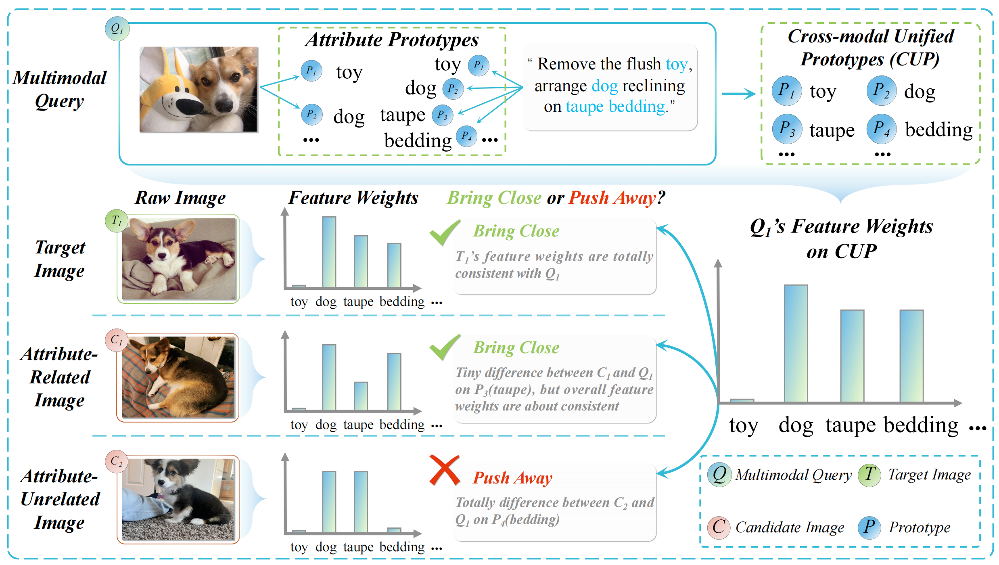
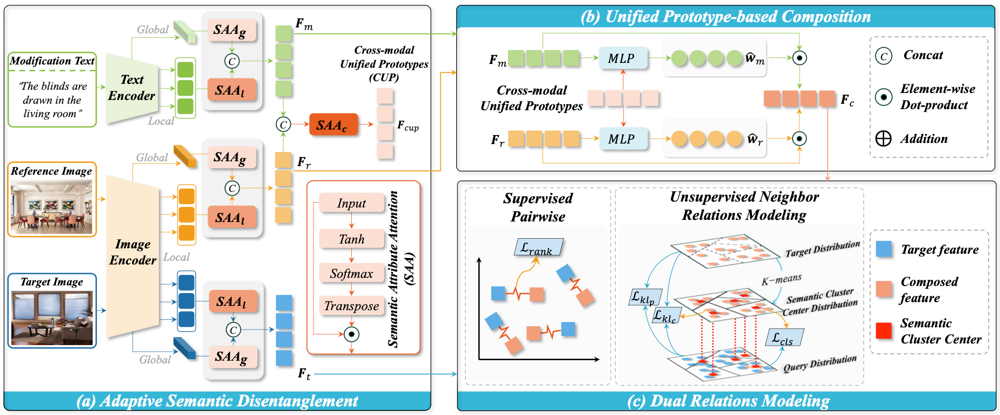
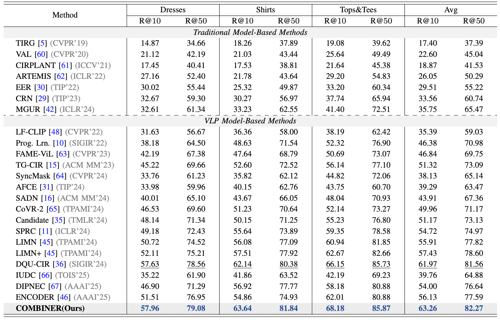
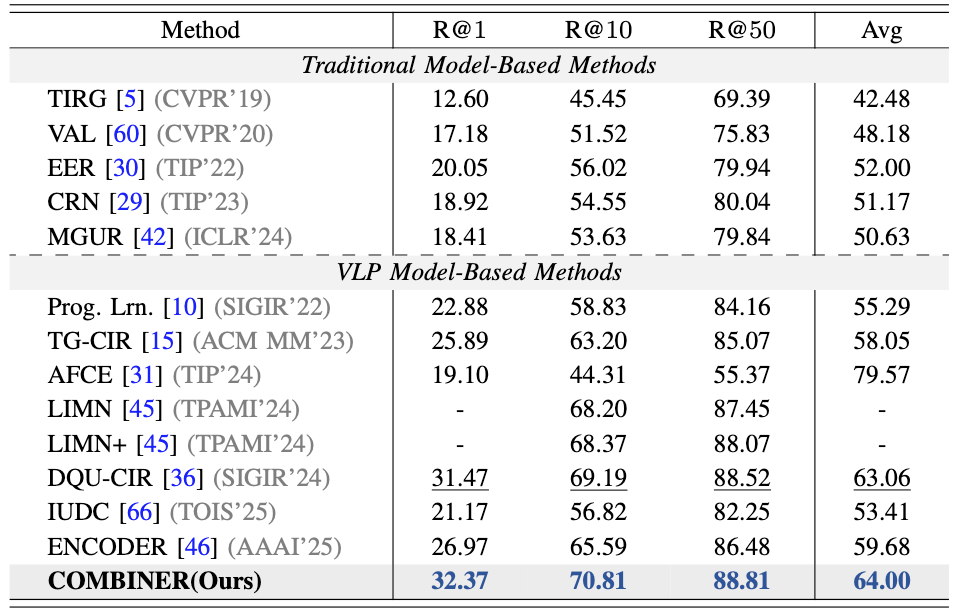
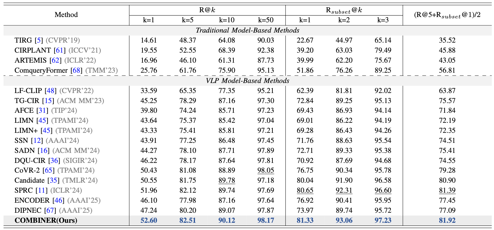
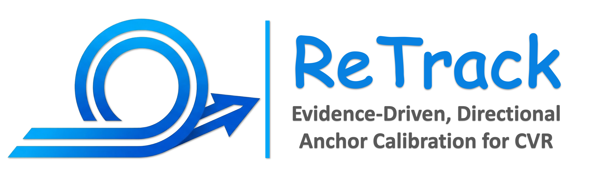
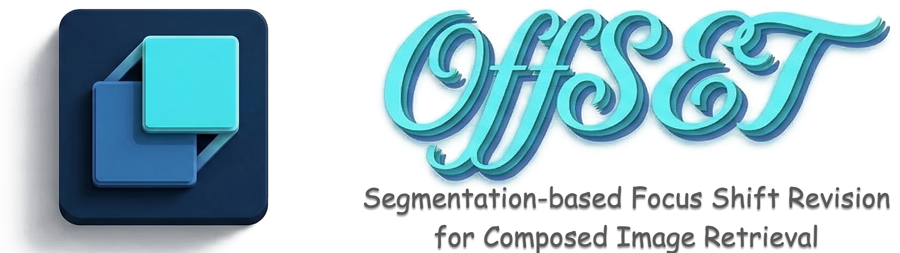

<a id="top"></a>
<div align="center">
   
  <h1>[TIP 2026] COMBINER: Composed Image Retrieval Guided by Attribute-based Neighbor Relations</h1>

  <p>
      <a href=""></a>
    <a href=""></a>
    <a href="https://lee-zixu.github.io/COMBINER.github.io/"></a>
        <a href="https://lee-zixu.github.io"></a>
    <a href="https://pytorch.org/get-started/locally/"></a>
    
    <a href="https://github.com/"></a>
  </p>
  <p>
    <b>Official Implementation:</b> A novel network designed to tackle the phenomenon of visually similar but attribute-unrelated samples in Composed Image Retrieval (CIR) by learning attribute-based neighbor relations.
  </p>
</div>

## 📌 Introduction
Welcome to the official repository for **COMBINER** (Composed Image Retrieval Guided by Attribute-based Neighbor Relations). 

Existing CIR approaches often overlook cases where images appear visually alike yet differ in attributes, potentially undermining both multimodal feature fusion and similarity modeling. **COMBINER** tackles these obstacles by introducing a unified representation of cross-modal features based on attribute prototypes. By utilizing adaptive semantic disentanglement, unified prototype-based composition, and dual relations modeling, COMBINER accurately understands the semantic relations among samples and achieves State-of-the-Art (SOTA) performance across multiple benchmark datasets.

<div align="center">
<p align="center">
  
  
<strong>Figure 1.</strong> Example of (a) Pairwise Relations, (b) Neighbor Relations, and (c) Visually Similar Images in Relations Modeling. In this figure, $Q$ denotes the multimodal query, $T$ denotes the target image, and $C$ denotes the candidate image. Fig. 1(c) illustrates the traditional neighbor relations modeling methodology brings both candidate images $C_1$ and $C_2$ close to $Q_1$. However, $C_2$ is visually similar but attribute-unrelated with $Q_1$ (“carpet” does not match the query “bedding”). Therefore, $C_2$ should not be brought close to $Q_1$.
</p>

<p align="center">
  
  
<strong>Figure 2.</strong>  Schematic of our proposed similarity measure method based on attribute prototypes.
</p>


</div>

[⬆ Back to top](#top)

## 📢 News
* **[2026-05-06]** 🚀 We officially release the main codes and framework of COMBINER!
* **[2026-04-30]** 🎉 COMBINER has been accepted by **TIP 2026**!

[⬆ Back to top](#top)

## ✨ Key Features
Our framework introduces three core modules to overcome attribute-level semantic entanglement and cross-modal inconsistency:

* 🔍 **Adaptive Semantic Disentanglement (ASD)**: Capable of adaptively disentangling attribute features based on multimodal primitive features, addressing the entanglement in attribute-level semantics.
* 🔗 **Unified Prototype-based Composition (UPC)**: Constructs Cross-modal Unified Prototypes (CUP) and serves as a shared dictionary to eliminate modal heterogeneity and facilitate multimodal feature composition.
* 🧩 **Dual Relations Modeling (DRM)**: Mines both supervised pairwise relations and unsupervised neighbor relations based on attribute similarity, effectively gathering visually similar and attribute-related samples while pushing away attribute-unrelated distractors.
* 🏆 **SOTA Performance**: Demonstrates superior retrieval accuracy and achieves remarkable improvements across both fashion-domain (FashionIQ, Shoes) and open-domain (CIRR) datasets.

[⬆ Back to top](#top)

## 🏗️ Architecture

<p align="center">
  
  <figcaption><strong>Figure 3.</strong> The overall framework of COMBINER. It consists of (a) Adaptive Semantic Disentanglement, (b) Unified Prototype-based Composition, and (c) Dual Relations Modeling.</figcaption>
</p>

[⬆ Back to top](#top)

## 📊 Experiment Results

COMBINER consistently outperforms existing baselines (e.g., DQU-CIR, SPRC, SADN) across all standard metrics on three major benchmarks.

### 1. FashionIQ & Shoes Datasets
*(Evaluated using Recall@K)*
<div align="center">
  
  
</div>

### 2. CIRR Dataset
*(Evaluated using R@K and R_subset@K)* <p align="center">
  
</p>

[⬆ Back to top](#top)


---

## 📑 Table of Contents

- [📌 Introduction](#-introduction)
- [📢 News](#-news)
- [✨ Key Features](#-key-features)
- [🏗️ Architecture](#️-architecture)
- [📊 Experiment Results](#-experiment-results)
- [📂 Repository Structure](#-repository-structure)
- [🚀 Installation](#-installation)
- [📂 Data Preparation](#-data-preparation)
  - [Shoes](#shoes)
  - [FashionIQ](#fashioniq)
  - [CIRR](#cirr)
- [🏃‍♂️ Quick Start](#️-quick-start)
  - [1. Training the Model](#1-training-the-model)
  - [2. Test for CIRR](#2-test-for-cirr)
- [🤝 Acknowledgements](#-acknowledgements)
- [✉️ Contact](#️-contact)
- [📝 Citation](#-citation)
- [🔗 Related Projects](#-related-projects)
- [🫡 Support & Contributing](#-support--contributing)

---

## 📂 Repository Structure
Our codebase is highly modular. Here is a brief overview of the core files:

```text
COMBINER/
├── cirr_test_submission.py# 📄 CIRR submission file generator
├── datasets_openclip.py   # 📚 Dataset loader and preprocessing
├── model.py               # 🧠 COMBINER model architecture and forward pass
├── test.py                # 🧪 Evaluation/Test entry point
├── train.py               # 🚀 Training entry point
├── utils.py               # 🛠️ Utility functions (metrics, helper methods)
└── README.md              # 📝 Documentation
```

## 🚀 Installation

**1. Clone the repository**
```bash
git clone https://github.com/iLearn-Lab/TIP26-COMBINER.git
cd COMBINER
```

**2. Setup Environment**
We recommend using Conda to manage your environment:

```bash
conda create -n combiner_env python=3.8.10
conda activate combiner_env

# Install PyTorch (Ensure it matches your CUDA version. Tested on PyTorch 2.0.0, NVIDIA A40 48G)
pip install torch==2.0.0 torchvision torchaudio --index-url https://download.pytorch.org/whl/cu118
```

## 📂 Data Preparation

COMBINER is evaluated on FashionIQ, Shoes, and CIRR. Please download the datasets from their official sources and arrange them as follows.

#### Shoes

Download the Shoes dataset following the instructions in the [official repository](https://github.com/XiaoxiaoGuo/fashion-retrieval/tree/master/dataset).

After downloading the dataset, ensure that the folder structure matches the following:

```text
├── Shoes
│   ├── captions_shoes.json
│   ├── eval_im_names.txt
│   ├── relative_captions_shoes.json
│   ├── train_im_names.txt
│   ├── [womens_athletic_shoes | womens_boots | ...]
|   |   ├── [0 | 1]
|   |   ├── [img_womens_athletic_shoes_375.jpg | descr_womens_athletic_shoes_734.txt | ...]
```

#### FashionIQ

Download the FashionIQ dataset following the instructions in the [official repository](https://github.com/XiaoxiaoGuo/fashion-iq).

After downloading the dataset, ensure that the folder structure matches the following:

```text
├── FashionIQ
│   ├── captions
|   |   ├── cap.dress.[train | val | test].json
|   |   ├── cap.toptee.[train | val | test].json
|   |   ├── cap.shirt.[train | val | test].json

│   ├── image_splits
|   |   ├── split.dress.[train | val | test].json
|   |   ├── split.toptee.[train | val | test].json
|   |   ├── split.shirt.[train | val | test].json

│   ├── dress
|   |   ├── [B000ALGQSY.jpg | B000AY2892.jpg | B000AYI3L4.jpg |...]

│   ├── shirt
|   |   ├── [B00006M009.jpg | B00006M00B.jpg | B00006M6IH.jpg | ...]

│   ├── toptee
|   |   ├── [B0000DZQD6.jpg | B000A33FTU.jpg | B000AS2OVA.jpg | ...]
```

#### CIRR

Download the CIRR dataset following the instructions in the [official repository](https://github.com/Cuberick-Orion/CIRR).

After downloading the dataset, ensure that the folder structure matches the following:

```text
├── CIRR
│   ├── train
|   |   ├── [0 | 1 | 2 | ...]
|   |   |   ├── [train-10108-0-img0.png | train-10108-0-img1.png | ...]

│   ├── dev
|   |   ├── [dev-0-0-img0.png | dev-0-0-img1.png | ...]

│   ├── test1
|   |   ├── [test1-0-0-img0.png | test1-0-0-img1.png | ...]

│   ├── cirr
|   |   ├── captions
|   |   |   ├── cap.rc2.[train | val | test1].json
|   |   ├── image_splits
|   |   |   ├── split.rc2.[train | val | test1].json
```

## 🏃‍♂️ Quick Start

### 1. Training the Model

Train COMBINER on Shoes, FashionIQ, or CIRR using the `train.py` script.

**General Training Command:**
```bash
python3 train.py \
    --model_dir ./checkpoints/ \
    --dataset {shoes, fashioniq, cirr} \
    --cirr_path "path/to/CIRR" \
    --fashioniq_path "path/to/FashionIQ" \
    --shoes_path "path/to/Shoes"
```

### 2. Test for CIRR

To generate the predictions file for uploading to the [CIRR Evaluation Server](https://cirr.cecs.anu.edu.au/) using our model, please execute the following command:

```bash
python src/cirr_test_submission.py model_path
```
*(Where `model_path` is the path to the COMBINER model checkpoint on CIRR, e.g., "checkpoints/COMBINER_CIRR.pt")*

## 🤝 Acknowledgements

This project builds upon recent advancements in Composed Image Retrieval and Vision-Language pre-training. We express our sincere gratitude to the open-source community for their contributions.

## ✉️ Contact

If you have any questions, feel free to [open an issue](https://github.com/Lee-zixu/COMBINER/issues) or reach out to us at:
`lizixu.cs@gmail.com` ☺️

## 📝⭐️ Citation

If you find our work or this code useful in your research, please consider leaving a **Star**⭐️ or **Citing**📝 our paper 🥰. Your support is our greatest motivation!

```bibtex
@article{li2025combiner,
  title={COMBINER: Composed Image Retrieval Guided by Attribute-based Neighbor Relations},
  author={Li, Zixu and Hu, Yupeng and Chen, Zhiwei and Wen, Haokun and Song, Xuemeng and Nie, Liqiang},
  journal={IEEE TIP},
  year={2025}
}
```

## 🔗 Related Projects

*Ecosystem & Other Works from our Team*


<table style="width:100%; border:none; text-align:center; background-color:transparent;">
  <tr style="border:none;">
      <td style="width:30%; border:none; vertical-align:top; padding-top:30px;">
      <br>
      <b>TEMA (ACL'26)</b><br>
      <span style="font-size: 0.9em;">
        <a href="https://arxiv.org/abs/2604.21806" target="_blank">Paper</a> | 
        <a href="https://lee-zixu.github.io/TEMA.github.io/" target="_blank">Web</a> | 
        <a href="https://github.com/Lee-zixu/ACL26-TEMA" target="_blank">Code</a>
      </span>
    </td>
    <td style="width:30%; border:none; vertical-align:top; padding-top:30px;">
      <br>
      <b>ConeSep (CVPR'26)</b><br>
      <span style="font-size: 0.9em;">
        <a href="https://arxiv.org/abs/2604.20358" target="_blank">Paper</a> | 
        <a href="https://lee-zixu.github.io/ConeSep.github.io/" target="_blank">Web</a> | 
        <a href="https://github.com/Lee-zixu/ConeSep" target="_blank">Code</a>  
      </span>
    </td>  
    <td style="width:30%; border:none; vertical-align:top; padding-top:30px;">
      <br>
      <b>Air-Know (CVPR'26)</b><br>
      <span style="font-size: 0.9em;">
        <a href="http://arxiv.org/abs/2604.19386" target="_blank">Paper</a> | 
        <a href="https://zhihfu.github.io/Air-Know.github.io/" target="_blank">Web</a> | 
        <a href="https://github.com/ZhihFu/Air-Know" target="_blank">Code</a>  
      </span>
    </td>  
      </tr>
  <tr style="border:none;">
    <td style="width:30%; border:none; vertical-align:top; padding-top:30px;">
      <br>
      <b>INTENT (AAAI'26)</b><br>
      <span style="font-size: 0.9em;">
        <a href="https://ojs.aaai.org/index.php/AAAI/article/view/39181" target="_blank">Paper</a> |
        <a href="https://zivchen-ty.github.io/INTENT.github.io/" target="_blank">Web</a> | 
        <a href="https://github.com/ZivChen-Ty/INTENT" target="_blank">Code</a> 
      </span>
    </td>  
    <td style="width:30%; border:none; vertical-align:top; padding-top:30px;">
      <br>
      <b>HABIT (AAAI'26)</b><br>
      <span style="font-size: 0.9em;">
        <a href="https://ojs.aaai.org/index.php/AAAI/article/view/37608" target="_blank">Paper</a> |
        <a href="https://lee-zixu.github.io/HABIT.github.io/" target="_blank">Web</a> | 
        <a href="https://github.com/Lee-zixu/HABIT" target="_blank">Code</a>
      </span>
    </td>
    <td style="width:30%; border:none; vertical-align:top; padding-top:30px;">
      <br>
      <b>ReTrack (AAAI'26)</b><br>
      <span style="font-size: 0.9em;">
        <a href="https://ojs.aaai.org/index.php/AAAI/article/view/39507" target="_blank">Paper</a> |
        <a href="https://lee-zixu.github.io/ReTrack.github.io/" target="_blank">Web</a> | 
        <a href="https://github.com/Lee-zixu/ReTrack" target="_blank">Code</a> |
      </span>
    </td>
  </tr>
  <tr style="border:none;">
    <td style="width:30%; border:none; vertical-align:top; padding-top:30px;">
      <br>
      <b>HUD (ACM MM'25)</b><br>
      <span style="font-size: 0.9em;">
        <a href="https://dl.acm.org/doi/10.1145/3746027.3755445" target="_blank">Paper</a> |
        <a href="https://zivchen-ty.github.io/HUD.github.io/" target="_blank">Web</a> | 
        <a href="https://github.com/ZivChen-Ty/HUD" target="_blank">Code</a> |
      </span>
    </td>
    <td style="width:30%; border:none; vertical-align:top; padding-top:30px;">
      <br>
      <b>OFFSET (ACM MM'25)</b><br>
      <span style="font-size: 0.9em;">
        <a href="https://dl.acm.org/doi/10.1145/3746027.3755366" target="_blank">Paper</a> |
        <a href="https://zivchen-ty.github.io/OFFSET.github.io/" target="_blank">Web</a> | 
        <a href="https://github.com/ZivChen-Ty/OFFSET" target="_blank">Code</a>
      </span>
    </td>
    <td style="width:30%; border:none; vertical-align:top; padding-top:30px;">
      <br>
      <b>ENCODER (AAAI'25)</b><br>
      <span style="font-size: 0.9em;">
        <a href="https://ojs.aaai.org/index.php/AAAI/article/view/32541" target="_blank">Paper</a> |
        <a href="https://sdu-l.github.io/ENCODER.github.io/" target="_blank">Web</a> | 
        <a href="https://github.com/Lee-zixu/ENCODER" target="_blank">Code</a>
      </span>
    </td>
  </tr>
</table>


## 🫡 Support & Contributing

We welcome all forms of contributions! If you have any questions, ideas, or find a bug, please feel free to:

  - Open an [Issue](https://github.com/Lee-zixu/COMBINER/issues) for discussions or bug reports.
  - Submit a [Pull Request](https://github.com/Lee-zixu/COMBINER/pulls) to improve the codebase.

[⬆ Back to top](#top)


<div align="center">
  

  <br><br>

  <a href="https://github.com/Lee-zixu/COMBINER">
    
  </a>
  <a href="https://github.com/Lee-zixu/COMBINER/issues">
    
  </a>
  <a href="https://github.com/Lee-zixu/COMBINER/pulls">
    
  </a>

  <br><br>
<a href="https://github.com/Lee-zixu/COMBINER">
    
  </a>
</div>
